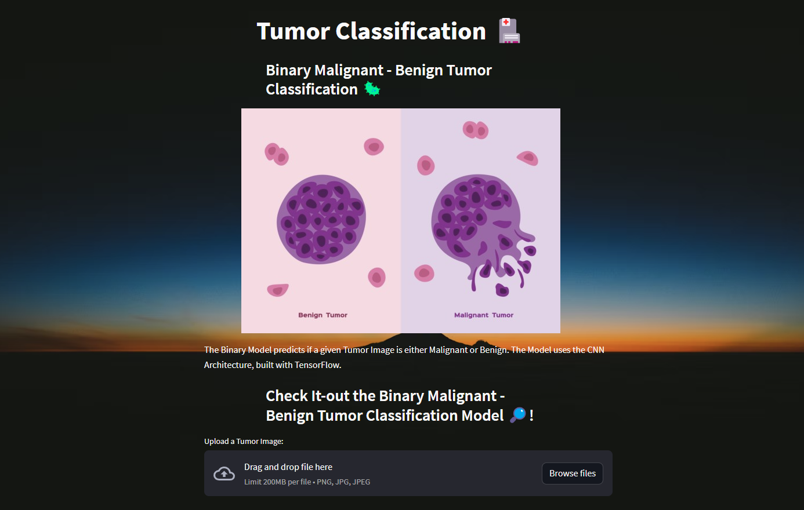
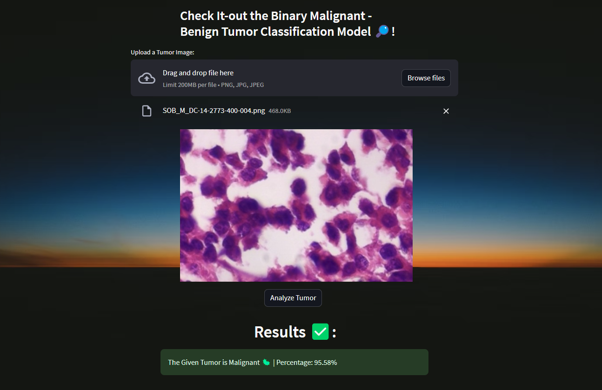

# Binary Tumor Classification Model with TensorFlow, Streamlit and Convolutional Neural Network 🏥



## Multi - Classification Model with TensorFlow and CNN

The Binary Model predicts if a given Tumor Image is either Malignant or Benign. The Model uses the CNN Architecture, built with TensorFlow.

## Check-it out
Test it by running the `app.py` file, built with `Streamlit`. Remember first to Train the Model using the Tumor Images Dataset.

## Run
```sh
streamlit run app.py
```



## Resources
Tumors Dataset: https://www.kaggle.com/datasets/paultimothymooney/breast-histopathology-images

